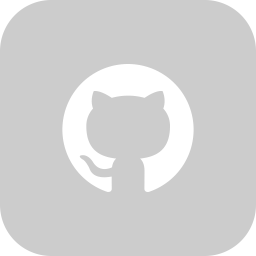

# Hey There 👋🏻
Greetings! I'm a tech-savvy full-stack developer who thrives on unraveling complex problems with precision. I find great satisfaction in applying my skills and knowledge to tackle intricate coding challenges and deliver innovative solutions.

But it's not all about code for me. I have a multifaceted personality, and one of my other great passions in life is the rich indulgence of coffee. I appreciate the art of brewing and savoring a perfectly crafted cup of coffee.

One of my favorite pastimes is playing chess, a game that challenges my strategic thinking and provides a welcome break from the digital realm. It stimulates my mind and allows me to disconnect from screens while exercising my mental faculties.

### **Here are some highlights about me:**
- 🔭 **Current Focus:** I am currently deeply engaged in the field of web development.
- 🌱 **Learning Journey:** I am actively expanding my knowledge in machine learning, web architecture, and exploring Laravel.
- 🥅 **2023 Goals:** My goals for this year are to make significant contributions to Open Source projects.
- ⚡ **Fun Fact:** In my free time, you can often find me engaged in a game of chess, appreciating music, and relishing a delicious cup of coffee.

### **Skills and Technologies:**

  

 

### **Latest Activity on GitHub:**
<!--RECENT_ACTIVITY:start-->
1. 💪 Opened PR [#1](https://github.com/SaturnsDevelopment/.github/pull/1) in [SaturnsDevelopment/.github](https://github.com/SaturnsDevelopment/.github)
2. 🔱 Forked [professor-2390/.github](https://github.com/professor-2390/.github) from [SaturnsDevelopment/.github](https://github.com/SaturnsDevelopment/.github)
3. 🔱 Forked [professor-2390/discordjs-verification-system](https://github.com/professor-2390/discordjs-verification-system) from [SaturnsDevelopment/discordjs-verification-system](https://github.com/SaturnsDevelopment/discordjs-verification-system)
4. 🔱 Forked [professor-2390/Red-DiscordBot](https://github.com/professor-2390/Red-DiscordBot) from [Cog-Creators/Red-DiscordBot](https://github.com/Cog-Creators/Red-DiscordBot)
5. 💪 Opened PR [#5](https://github.com/BlurpleSaturn/leaf-languages/pull/5) in [BlurpleSaturn/leaf-languages](https://github.com/BlurpleSaturn/leaf-languages)
<!--RECENT_ACTIVITY:end-->

  
<b>⚡ GitHub and Discord Stats</b>

   
 
 

 
 
 

  
  

